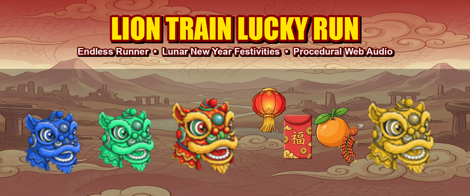
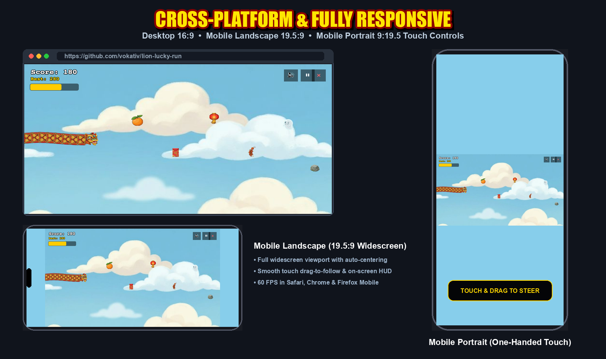
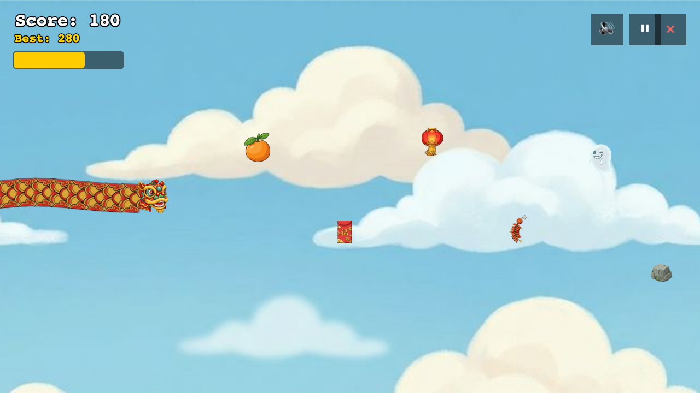
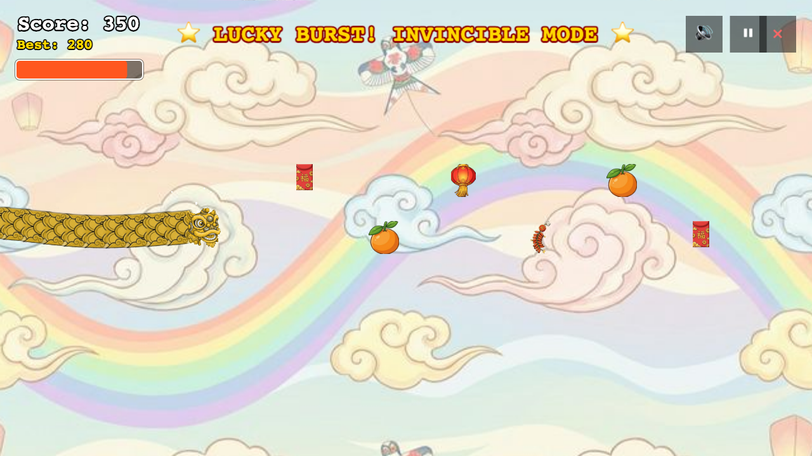
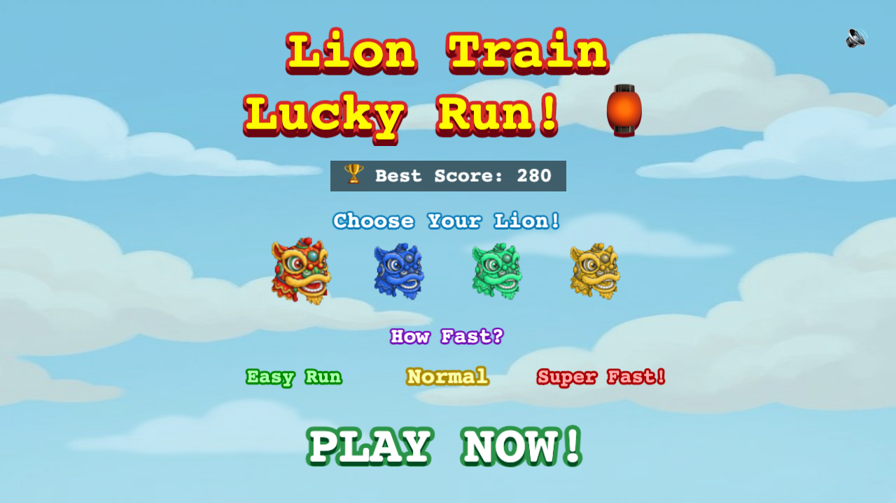
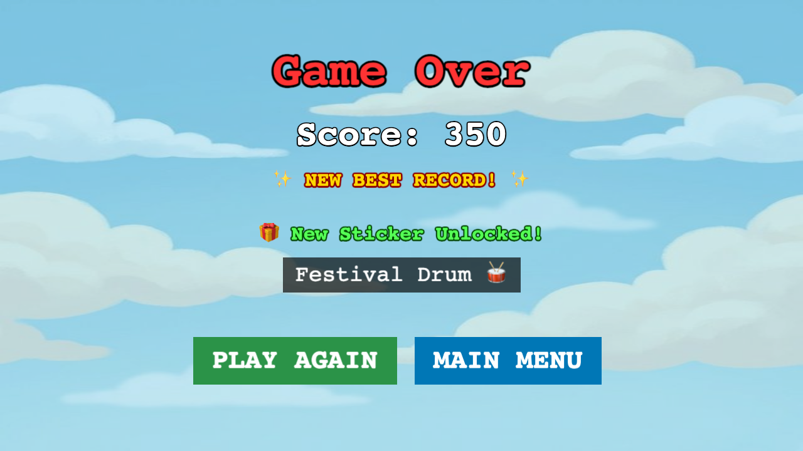

<p align="center">
  
</p>

<h1 align="center">🏮 Lion Lucky Run - A Lunar New Year Adventure</h1>

<p align="center">
  <strong>An energetic, festive endless runner celebrating Chinese New Year traditions!</strong><br>
  Lead your Lion Dance troupe, collect auspicious treats, unleash the invincible Golden Lucky Burst, and collect lucky stickers!
</p>

<p align="center">
  
  
  
  
  
</p>

---

## 📱 Cross-Platform & Mobile Responsive

Playable seamlessly on **Desktop browsers, Chromebooks, iPads/tablets, and mobile smartphones (iOS / Android)** with intelligent viewport auto-scaling and dedicated touch-drag controls.

<p align="center">
  
</p>

---

## 📸 In-Game Screenshots

<table align="center">
  <tr>
    <td width="50%" align="center">
      <strong>🎮 Action Gameplay & Lion Train</strong><br><br>
      
    </td>
    <td width="50%" align="center">
      <strong>⭐ "Lucky Burst" Invincibility Mode</strong><br><br>
      
    </td>
  </tr>
  <tr>
    <td width="50%" align="center">
      <strong>🎨 Costume & Difficulty Selection</strong><br><br>
      
    </td>
    <td width="50%" align="center">
      <strong>🏆 Score Records & Sticker Rewards</strong><br><br>
      
    </td>
  </tr>
</table>

---

## 🏮 About Chinese New Year (Lunar New Year)

**Chinese New Year** (or Lunar New Year) is one of the most celebrated holidays across Asia and worldwide, marking the start of a new lunisolar calendar year with wishes for prosperity, luck, and joy.

Key cultural symbols featured in **Lion Lucky Run**:
* 🦁 **The Lion Dance (舞獅):** Performers mimic lion movements in ornate costumes to bring blessings, good fortune, and ward off negative energies.
* 🧧 **Red Envelopes (Hongbao):** Red packets filled with lucky money given to express love, blessings, and prosperity.
* 🍊 **Lucky Oranges & Tangerines:** Auspicious fruits representing wealth and abundance (*orange* sounds like *gold* in Chinese).
* 🏮 **Festive Lanterns & Firecrackers:** Bright red lanterns illuminate paths of luck, while firecrackers welcome the new year with excitement!

---

## ✨ Features & Game Mechanics

1. 🐉 **Dynamic Inverse-Kinematics Lion Train:**
   * Your lion grows an organic waving body and tail as you collect fortune!
   * Distance-constrained trailing eliminates stretching and provides responsive turning.
2. 🎨 **4 Selectable Lion Costumes:**
   * 🔴 **Classic Red Lion** • 🟢 **Jade Green Lion** • 🟡 **Imperial Golden Lion** • 🔵 **Ocean Blue Lion**
3. ⭐ **"Lucky Burst" Super Mode:**
   * Collect items to fill your Fortune Meter to 100% and transform into the **Golden Lion**!
   * Smash invincibly through obstacles with glittering trail particles and rainbow backgrounds.
4. 🛡️ **Bouncy Grace Period Mechanics:**
   * Forgiving design for players of all ages—hitting an obstacle with fortune in reserve triggers a cartoon **"Bonk"** bounce and temporary invulnerability window rather than instant defeat.
5. 🏆 **Sticker Album & Persistent High Scores:**
   * Score 50+ points in a run to unlock festive stickers (🦁 Lion Head, 🏮 Lantern, 🍊 Orange, 🥁 Drum, 🧨 Firecracker, 🪙 Gold Ingot).
   * High scores and unlocked stickers persist across sessions with safe sandboxed localStorage fallbacks.
6. 🎵 **Procedural Web Audio Synthesizer:**
   * Zero external audio files required! Built-in Web Audio synthesis generates authentic pentatonic chimes, celebratory fanfares, and cartoon bounce sounds on the fly.

---

## 🕹️ Controls

| Platform | Controls |
| :--- | :--- |
| **Desktop Keyboard** | **Arrow Keys (⬆️ ⬇️ ⬅️ ➡️)** or **WASD** to move smoothly in all directions |
| **Desktop Mouse** | **Click & Drag / Move:** Lion glides toward your cursor position |
| **Mobile / Touchscreen** | **Touch & Drag:** Slide your finger anywhere on screen to steer with guardrails |
| **Hotkeys** | **P / ESC** = Pause / Resume • **Q** = Quit to Main Menu • **🔊** = Audio Toggle |

---

## 🛠️ Local Development & Scripts

```bash
# Install dependencies
npm install

# Start local development server (Vite)
npm run dev

# Run production build
npm run build

# Preview production build locally
npm run preview
```

---

## 📁 Project Structure

```text
lion-lucky-run/
├── index.html                   # Entry point with responsive viewport canvas
├── vite.config.ts               # Vite configuration (relative base './')
├── ITCH_IO_METADATA.md          # Complete store listing metadata & guide
├── media/
│   ├── itch/                    # Store assets (covers, banner, avatar)
│   └── screenshots/             # In-game captures & responsive showcase
│       ├── banner.png           # Header banner
│       ├── screenshot-gameplay-action.png
│       ├── screenshot-lucky-burst.png
│       ├── screenshot-menu-selection.png
│       ├── screenshot-results-stickers.png
│       ├── screenshot-mobile-portrait.png
│       ├── screenshot-mobile-landscape.png
│       └── showcase-responsive-devices.png
├── scripts/
│   ├── capture_game_screens.mjs # Headless Chrome screenshot automation
│   └── build_marketing_assets.py# Marketing asset compositor (Pillow)
├── src/
│   ├── main.ts                  # Phaser initialization
│   ├── game/config.ts           # Game canvas resolution (1280x720 Scale.FIT)
│   ├── entities/                # Player, LionTail (IK trailing physics)
│   ├── scenes/                  # Boot, Menu, Game, Pause, Results scenes
│   ├── systems/                 # Spawner, Fortune, Stickers, Audio synthesizer
│   ├── storage/                 # Sandboxed iframe-safe settings & high scores
│   └── ui/                      # FortuneMeter HUD component
└── public/assets/               # Game sprites, backgrounds, audio
```

---

## 📝 License

This project is licensed under the [MIT License](LICENSE).
